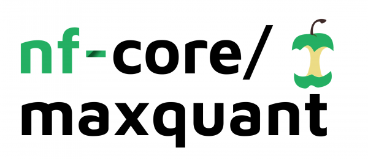

# 

**Implementation using sdrf and maxquant under the nf-core ruleset**.

[](https://github.com/nicni16/nfcore-maxquant/actions?query=workflow%3A%22nf-core+CI%22)
[](https://github.com/nicni16/nfcore-maxquant/actions?query=workflow%3A%22nf-core+linting%22)
[](https://www.nextflow.io/)

[](https://bioconda.github.io/)
[](https://hub.docker.com/repository/docker/lnkn/nfcore-maxquant)
[](https://nfcore.slack.com/channels/maxquant)

## Introduction

**nf-core/maxquant** MaxQuant is a quantitative proteomics software package designed for analyzing large mass-spectrometric data sets. This is developed to easier combine an easy generation of input files together with a normalyzer for the output of Maxquant.

The pipeline is built using [Nextflow](https://www.nextflow.io), a workflow tool to run tasks across multiple compute infrastructures in a very portable manner. It comes with docker containers making installation trivial and results highly reproducible.

## Quick Start

1. Install [`nextflow`](https://nf-co.re/usage/installation)

2. Install any of [`Docker`](https://docs.docker.com/engine/installation/), [`Singularity`](https://www.sylabs.io/guides/3.0/user-guide/), [`Podman`](https://podman.io/), [`Shifter`](https://nersc.gitlab.io/development/shifter/how-to-use/) or [`Charliecloud`](https://hpc.github.io/charliecloud/) for full pipeline reproducibility _(please only use [`Conda`](https://conda.io/miniconda.html) as a last resort; see [docs](https://nf-co.re/usage/configuration#basic-configuration-profiles))_

3. Download the pipeline and test it on a minimal dataset with a single command:

    ```bash
    nextflow run main.nf -profile test,<docker/singularity/podman/shifter/charliecloud/conda/institute>
    ```

    > Please check [nf-core/configs](https://github.com/nf-core/configs#documentation) to see if a custom config file to run nf-core pipelines already exists for your Institute. If so, you can simply use `-profile <institute>` in your command. This will enable either `docker` or `singularity` and set the appropriate execution settings for your local compute environment.

4. Start running your own analysis!

    ```bash
    nextflow run main.nf -profile <docker/singularity/podman/shifter/charliecloud/conda/institute> --fasta '*.raw' --sdrf '*.tsv' --experiment_design '*.txt'

    ```

See [usage docs](https://nf-co.re/maxquant/usage) for all of the available options when running the pipeline.

## Pipeline Summary

By default, the pipeline currently performs the following:

* Generating maxquant input file (`SDRF`)
* Running the overall analysis (`Maxquant`)
* Normalizing the results (`Normalyzered`)

## Documentation

The nf-core/maxquant pipeline comes with documentation about the pipeline: [usage](https://nf-co.re/maxquant/usage) and [output](https://nf-co.re/maxquant/output).

This workflow is based on Nextflow, running with SDRF implemented. Normalization and statistical comparisons using NormalyzerDE are conducted on the MaxQuant results.

Download the raw files from PRIDE: <http://proteomecentral.proteomexchange.org/cgi/GetDataset?ID=PXD001819>

Run the workflow, giving the following parameters:

1) The rawfolder, and nextflow needs read and write access to the directory. The path needs to absolute and not relative.
2) The SDRF.tsv file. Relative paths works fine.
3) The fasta file, and this needs a absolute file path, not relative.
4) The absolute path to the experimental design file
5) (Optional) Which normalization method to use.
6) (Optional) The group comparisons to perform in NormalyzerDE. Without this parameter, the comparison will be versus
the first condition.

Just make sure to update the paths in the configuration file, and then run as

## Credits

nf-core/maxquant was originally written by NKN & VS.

We thank the following people for their extensive assistance in the development
of this pipeline:

Fredrik Levander for contributing on the implementation of the NormalyzerDE function.

## Contributions and Support

If you would like to contribute to this pipeline, please see the [contributing guidelines](.github/CONTRIBUTING.md).

For further information or help, don't hesitate to get in touch on the [Slack `#maxquant` channel](https://nfcore.slack.com/channels/maxquant) (you can join with [this invite](https://nf-co.re/join/slack)).

## Citations

You can cite the `nf-core` publication as follows:

> **The nf-core framework for community-curated bioinformatics pipelines.**
>
> Philip Ewels, Alexander Peltzer, Sven Fillinger, Harshil Patel, Johannes Alneberg, Andreas Wilm, Maxime Ulysse Garcia, Paolo Di Tommaso & Sven Nahnsen.
>
> _Nat Biotechnol._ 2020 Feb 13. doi: [10.1038/s41587-020-0439-x](https://dx.doi.org/10.1038/s41587-020-0439-x).

In addition, references of tools and data used in this pipeline are as follows:

Software used:
SDRF-pipelines:
Perez-Riverol, Yasset, and European Bioinformatics Community for Mass Spectrometry. "Toward a Sample Metadata Standard in Public Proteomics Repositories." Journal of Proteome Research 19.10 (2020): 3906-3909. [Manuscript](https://pubs.acs.org/doi/abs/10.1021/acs.jproteome.0c00376)

Maxquant:
Cox, J., Mann, M. MaxQuant enables high peptide identification rates, individualized p.p.b.-range mass accuracies and proteome-wide protein quantification. Nat Biotechnol 26, 1367–1372 (2008). <https://doi.org/10.1038/nbt.151>

NormalyzerDE:
Willforss, J., Chawade, A., Levander, F. NormalyzerDE: Online tool for improved normalization of omics expression data and high-sensitivity differential expression analysis. Journal of Proteome Research 2018, 10.1021/acs.jproteome.8b00523.
